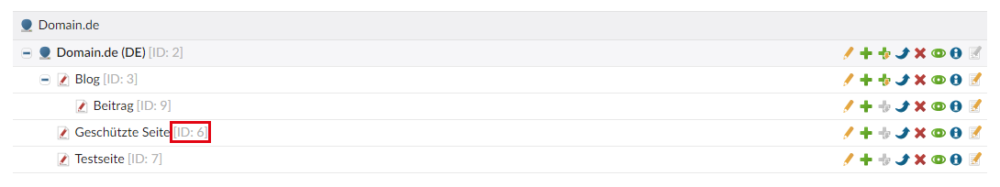
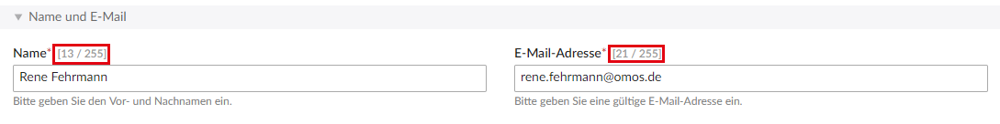
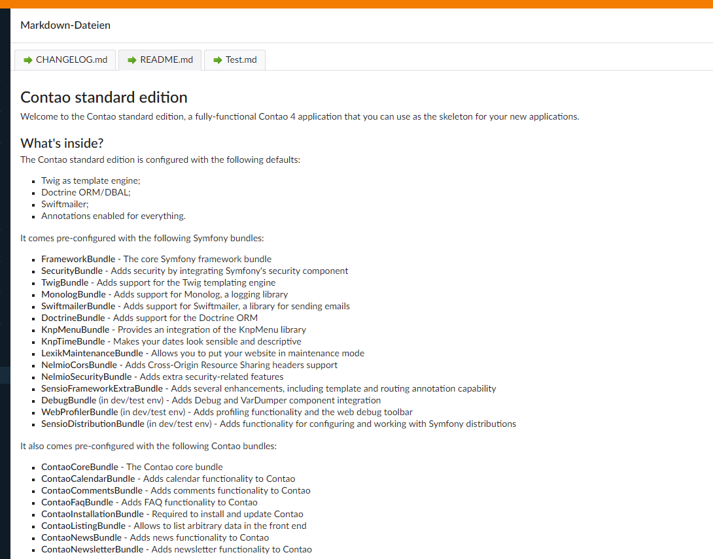
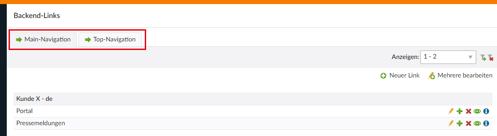
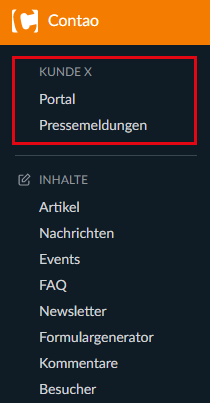
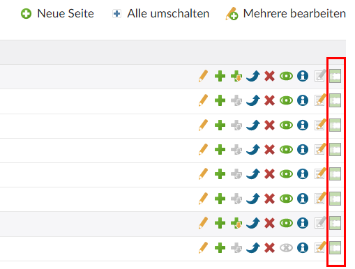
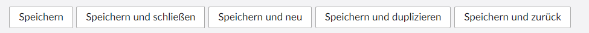
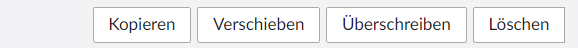

## 1. Features

### 1.1 Toolbar

Eine praktische Toolbar für wichtige Funktionen im Backend. Die Toolbar positioniert sich rechter Hand im Backend an 
einer fixen Stelle. Nachfolgend eine kleine Auflistung der Buttons und ihrer Funktion:

- ID-/Alias-Suche (Feature wird weiter unten genauer beschrieben)
- Install-Tool (dieser Button verlinkt direkt ins Install-Tool)
- ein neues Template erstellen (Kurzlink)
- Syncronisation der Dateiverwaltung (Kurzlink)
- Contao-Manager (dieser Link verlinkt direkt zum Contao-Manager 'contao-manager.phar.php')

Für jedes vorhandene Theme werden folgende 4 Buttons bereitgestellt:

- Stylesheets
- Module
- Seitenlayouts
- Bildgrößen

Außerdem werden noch die derzeit verfügbaren Speichern-Button hinzugefügt.

Alle Buttons verfügen über ein Tooltip bei Mouse-Hover.

### 1.2 Sprache bei den Startpunkten hinzufügen

Wie der Titel besagt, werden bei allen Startpunkten die jeweilige Sprache hinzugefügt. Dies ist praktisch bei 
mehrsprachigen Projekten. Dies gilt auch für den neuen DCA-Picker.


### 1.3 ID-/Alias-Suche

Die ID-/Alias-Suche dient der direkten Auffindung von Datensätzen von denen die ID bzw. der Alias (falls in der 
Tabelle vorhanden) bekannt ist. Sollte der Datensatz gefunden werden, wird direkt zur Bearbeitung des Datensatzes 
gesprungen. Dies gilt auch für Tabellen, welche durch andere Backend-Module bereitgestellt werden.
 
Diese Suchfunktion ist auch als Button in der Toolbar verfügbar.
 
### 1.4 ID´s mit 'Shift' anzeigen

Während der Entwicklung ist es oft notwendig, die genaue ID eines Datensatzes zu kennen. Hierbei hilft das Anzeigen der ID´s in dem die Shift-Taste gehalten wird. Dies funktioniert in den meisten Listenansichten.



### 1.4 Textlänge für Textfelder

Es werden bei allen Textfelder (DCA Inputtype == 'text') die Anzahl der Textlänge angezeigt. Falls vorhanden, wird auch die Maximallänge mit angezeigt.



### 1.6 Markdown-Viewer

Es werden alle Markdown-Dateien im Root-Verzeichnis der Contao-Installation (nicht in /web) im Backend zum Lesen aufbereitet. Dabei 
findet eine Umwandlung in das HTML-Format statt. Rudimentäres Standard-CSS für diese Ansicht liefert das Bundle bereits mit.



__Hinweis__: Im Grunde handelt es sich um eine ähnliche Funktion wie ursprünglich bei 'System-Informationen'. Ich setze mittlerweile zur Darstellung von kundenspezifischen Informationen im Backend nur noch den Markdown-Viewer ein.

### 1.7 Backend CSS

Dieses Feature ergänzt, für die Eigenschaft 'tl_class' in den Evaluation-Einstellungen des DCA, die Klassen 'w25', 
'w33', 'w66', 'w75' und 'heightAuto'. Die w-Klassen ermöglichen neue Kombinationsmöglichkeiten für die Anordnung der
 DCA-Felder im Backend. So sind nun beispielsweise 3 oder gar 4 Felder in einer Reihe möglich, was im neuen 
 Fullwidth-Layout des Backends durchaus Vorteile haben kann.


Die Klasse 'heightAuto' ist für Felder gedacht, die sich bisher nicht nebeneinander anordnen lassen. Dies betrifft 
zum Beispiel die Inputtypes 'textarea', 'fileTree', 'pageTree' und weitere. Diese lassen sich nun beispielsweise mit 
'tl_class'=>'w50 heightAuto' ebenfalls floaten.


Die neuen Klassen verhalten sich bei geringer Viewport-Breite genauso wie die bisherige Klasse 'w50'.

Die neuen Links werden stets am Anfang der Hauptnavigation eingefügt.

### 1.8 Backend Tabs

Mit diesem Feature lassen sich innerhalb eines Backend-Moduls weitere beliebige Backend-Module in Tabs darstellen. 
Das Backendmodul 'Backend-Links' nutzt dieses Feature. Das lässt sich am besten mittels Screenshots zeigen.



Die Konfiguration erfolgt dabei in der Datei config/config.php des Backend-Moduls. Nachfolgend der verwendete Code 
für den obigen Beispiel-Screenshot:

```
/**
 * Additional backend modules
 */
$GLOBALS['BE_MOD']['om_backend']['backend_links'] = array
(
    'callback' => 'OMOSde\ContaoOmBackendBundle\ModuleBackendTabs',
    'tabs'     => array
    (
        'backend_links_main',
        'backend_links_top'
    )
);
```

Hinweis: Die in Tabs verwendeten Module werden aus der Hauptnavigation des Backends entfernt.


### 1.9 Backend-Links

Eine Funktion die wir häufig für Kunden nutzen. Einerseits stellen wir dem Kunden in der Top-Navigation unsere Kontaktdaten zur Verfügung:
 


Andererseits kürzen wir Wege im Backend ab. In der Vielzahl der Fälle führen die Links etwa direkt in einzelne Nachrichtenarchiv oder führen zu externen Seiten.




### 1.10 User-Redirects

Ermöglicht das Weiterleiten von Backendbenutzern beim Login. Die entsprechende URL kann bei den Benutzern- bzw. den Benutzergruppen-Einstellungen angegeben werden. Dabei wird auch der jeweilige Entrypoint berücksichtigt. Zum Beispiel leitet 'do=news&table=tl_news&id=1' direkt in die Nachrichten des Archivs mit der ID 1 weiter.
 
 
### 1.11 Layout-Button in Seitenstruktur

Ergänzt in der Seitenstruktur einen Button, um direkt in die Bearbeitung des zugehörigen Layouts zu springen. Die Vererbung der Layouts wird beachtet.
 


### 1.12 Speichern- und Mehrere bearbeiten-Buttons ohne Untermenü

Dieses Features löst die Untermenüs der Speicher- und Mehrere bearbeiten-Buttons per CSS wieder auf. Dies gilt derzeit nur für einen Viewport breiter als 1200px.




### 1.13 Backend - Full width

Kann die Breite des Backends wieder auf die gesamte verfügbare Breite ausweiten.

### 1.14 Element-Klassen

Einzelnen Inhaltselementen oder Artikeln CSS-Klassen zuweisen. [Details][2]

### 1.15 Systeminformationen

Mehr über das grundlegende System erfahren. [Details][3]

### 1.16 Reihenfolge der Backendmodule

In den Systemeinstellungen lässt sich nun die Reihenfolge der Backendmodule einstellen.

## 2. Nachwort

Das vorliegende Modul ist bei mir quasi in allen Contao-Projekte als Standard mit dabei. Es entstand aus Ideen und 
Anforderungen, die immer mal wieder aus den Projekten selbst hervorgingen.

Gerne nehme ich Ideen für Features entgegen.

[2]: handbook/features/element_classes.md
[2]: handbook/features/system_information.md